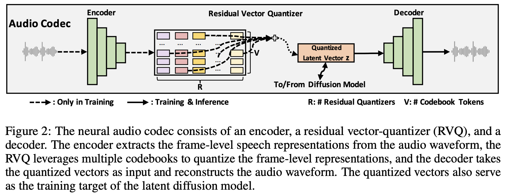
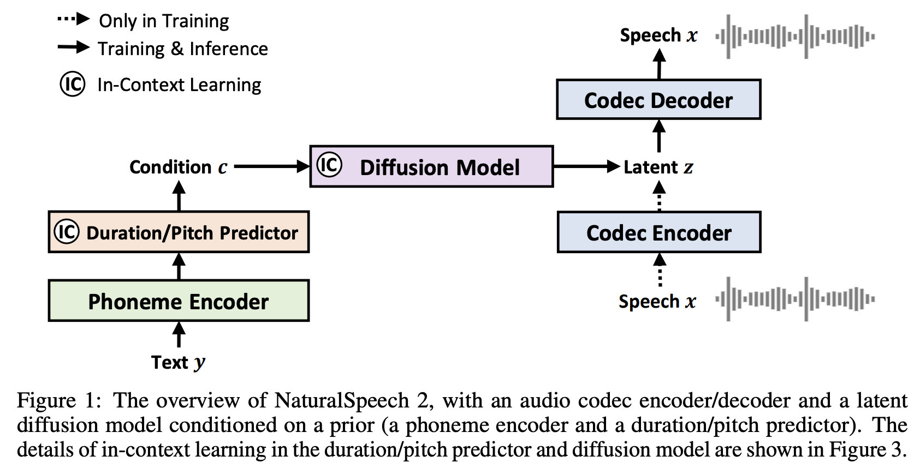

# NaturalSpeech2 PyTorch

  

  

PyTorch implementation of NaturalSpeech 2

[NaturalSpeech 2](https://arxiv.org/abs/2304.09116): Latent Diffusion Models are Natural and Zero-Shot Speech and Singing Synthesizers.
